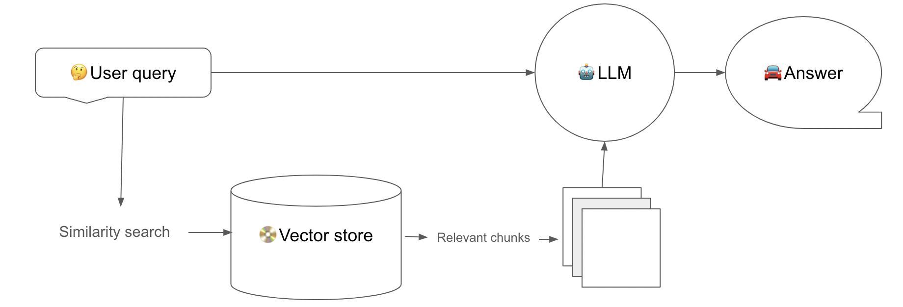

# RAG LLM ChatBot with Langchain 🦜️🔗 

## Index

1. **Introduction**
   - Overview
   - Key Features
2. **Installation**
   - Prerequisites
   - Step-by-Step Guide
3. **Usage**
   - Basic Usage
   - Advanced Configuration
   - Data Management
4. **Examples**
   - Simple Query Example
   - Complex Query Example
5. **Architecture**
   - System Overview
   - Key Components
6. **Contributing**
   - How to Contribute
   - Code of Conduct
7. **License**
   - License Information
8. **Contact**
   - Support
   - Feedback

### Introduction
- **Overview:** The RAG LLM ChatBot leverages Langchain to provide a robust and flexible framework for building intelligent chatbots. It combines the power of retrieval-augmented generation (RAG) with large language models (LLMs) to deliver precise and context-aware responses.
- **Key Features:** 
  - Seamless integration with various data sources
  - High accuracy in information retrieval
  - Customizable for different use cases and industries
  - Scalable and efficient performance

### Installation
- **Step-by-Step Guide:** 
  - For instructions on how to set up and run this project in your local environment, please see [RUNNING_LOCALLY.md](RUNNING_LOCALLY.md).

### Usage
- **Basic Usage:** 
  - Start the chatbot with a simple command.
  - http://0.0.0.0:8000/chat/playground/
- **Advanced Configuration:** 
  - Customize the chatbot's behavior through configuration files.
  - Example: Adjusting the retrieval model settings and response generation parameters.
- **Data Management:** 
  - Manage the chatbot's knowledge base and data sources.
  - Example: Adding new data, updating existing data, or removing outdated data.
  - The project uses a shared data directory (`./data`) that is mounted to the Docker container.
  - Place your CSV files in this directory to be automatically ingested by the system.
  - You can update the data without rebuilding the Docker container.
  - The system will automatically detect and load all CSV files in the data directory.

### Examples
- **Simple Query Example:** 
  - Demonstrate how to handle a basic user query.
  - Example: "What's the weather like today?"
- **Complex Query Example:** 
  - Showcase handling of a multi-turn conversation with context preservation.
  - Example: Research-based queries or technical support scenarios.

### Architecture
- **System Overview:** 
  - RAG, or Retrieval-Augmented Generation, is a technique used in large language models (LLMs) to improve the accuracy and relevance of generated responses. It combines two key processes:
    1. **Retrieval:** This process involves fetching relevant information from a pre-defined dataset or knowledge base. The retrieval model identifies and selects the most pertinent documents or data points related to the user's query.
    2. **Generation:** Once the relevant information is retrieved, the generation model (typically an LLM) uses this information to craft a coherent and contextually appropriate response.

    
    

By integrating retrieval and generation, RAG enhances the language model's ability to provide accurate and context-aware answers, particularly for complex or specific queries that require detailed information. This approach leverages the strengths of both retrieval systems (accuracy and relevance) and generation models (fluency and contextual understanding).
  
- **Key Components:** 
  - Ingesting Data: The chatbot's knowledge base is populated with relevant data from various sources, such as FAQs, manuals, or structured databases.
  - Retrieval Model: This component retrieves relevant information from the knowledge base based on the user's query. It uses techniques like BM25 or dense retrieval to identify the most suitable documents.
  - Prompt Engineering: The system generates prompts or templates to guide the language model in crafting responses. These prompts provide context and structure for the generation process.
    Sure, here's a table with the steps and detailed explanations from the context of a car sales agent role:
    
    | **Step**                                 | **Description**                                                                                                                    |
    |------------------------------------------|------------------------------------------------------------------------------------------------------------------------------------|
    | Define the objective or purpose of the query, using strong verbs | Clearly identify and articulate the main goal of the interaction with the customer, such as "assist in selecting," "explain features," or "finalize purchase." This helps in guiding the conversation effectively. |
    | Define the profile or personality         | Understand and outline the customer's profile, including their preferences, needs, and buying motivations. This might involve identifying if the customer is looking for a family car, a luxury vehicle, or a budget-friendly option. |
    | Conduct the query with clear and specific language | Engage with the customer using precise and straightforward language. Avoid jargon and be concise to ensure the customer fully understands the information and options being presented. |
    | Provide necessary context or details      | Offer relevant background information and specifics about the cars, such as mileage, history, features, and pricing. This helps the customer make an informed decision by understanding the value and condition of the vehicle. |
    | Response format                           | Structure responses in a clear and organized manner. For example, start with a greeting, address the customer's query, provide detailed answers, and end with an invitation for further questions or a call to action. |
    - Tools:
      - https://docs.rungalileo.io/
      - https://promptlayer.com/
  - Chains: The chatbot's conversational flow is managed through chains, which define the sequence of actions and responses during a conversation. Chains can handle multi-turn dialogues, context preservation, and user interactions.
  - Callbacks: Custom functions or scripts that execute specific actions based on user inputs or system events. Callbacks can trigger external APIs, perform calculations, or update the chatbot's state.

### Contributing
- **How to Contribute:** 
  - Guidelines for submitting issues and pull requests.
  - Example: Follow coding standards and provide detailed descriptions for contributions.
- **Code of Conduct:** 
  - Ensure a welcoming and inclusive environment for all contributors.

### License
- **License Information:** 
  - Specify the open-source license under which the project is distributed.
  - Example: MIT License.

### Contact
- **Support:** 
  - Provide contact details or a link to a support forum.
  - Example: Email or Discord server.
- **Feedback:** 
  - Encourage users to provide feedback and suggestions.
  - Example: Link to a feedback form or GitHub Discussions.

